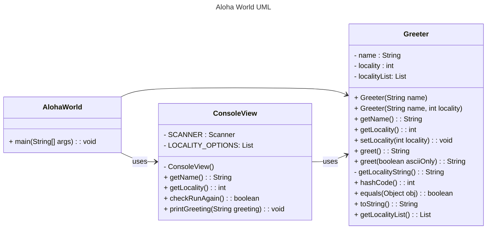

# Homework Aloha World Report

The following report contains questions you need to answer as part of your submission for the homework assignment.

## Design Doc

Please link your UML design file here. See resources in the assignment on how to
link an image in markdown. You may also use [mermaid] class diagrams if you prefer, if so, include the mermaid code here. You DO NOT have to include Greeting.java as part of the diagram, just the AlohaWorld application that includes: [AlohaWorld.java], [Greeter.java], and [ConsoleView.java].

### Program Flow

AlohaWorld.java in the entery of our program. It creates an object of Greeter and uses ConsoleView class to get the input from the user and show the output.

The Greeter class is responsible for greeting the user. The ConsoleView class is responsible for getting the input from the user and showing the output. AlohaWorld class is responsible for controling the flow of the whole program.

## Assignment Questions

1. List three additional java syntax items you didn't know when reading the code. (make sure to use \* for the list items, see example below, the backtick marks are used to write code inline with markdown)

   - `final class`
   - `static` method and attribute
   - `@Override` syntax

2. For each syntax additional item listed above, explain what it does in your own words and then link a resource where you figured out what it does in the references section.

   - `final class` is used to prevent the class from being inherited by other classes. It is used to make the class immutable.
   - `static` method and attribute are used to make the method or attribute belong to the class rather than the object. We can call them without creating an object of the class.
   - `@Override` syntax is used to tell the compiler that the following method is overriding a method in the superclass.

3. What does `main` do in Java?

   The `main` method is the entry of the program. It is the first method that is called when the program is executed.

4. What does `toString()` do in Java? Why should any object class you create have a `toString()` method?

   `toString()` method can convert a object to a string. It is useful for debugging, where we can print the object out to see the content of the object.

5. What is javadoc style commenting? What is it used for?

   Javadoc style commenting is a way to write comments in Java. It is used to generate documentation for the code.

6. Describe Test Driving Development (TDD) in your own words.

   Test Driving Development means that we would first write the test, then we write the code. By writing tests, we will know what we actually want, and what we expect the program should work. Then we write the code to make the test pass.

7. Go to the [Markdown Playground](MarkdownPlayground.md) and add at least 3 different markdown elements you learned about by reading the markdown resources listed in the document. Additionally you need to add a mermaid class diagram (of your choice does not have to follow the assignment. However, if you did use mermaid for the assignment, you can just copy that there). Add the elements into the markdown file, so that the formatting changes are reserved to that file.

## Deeper Thinking Questions

These questions require deeper thinking of the topic. We don't expect 100% correct answers, but we encourage you to think deeply and come up with a reasonable answer.

1. Why would we want to keep interaction with the client contained to ConsoleView?

   We let each class do one thing. The ConsoleView class is responsible for the input from the user and showing the output. If we want to change the way we get the input or show the output, we only need to change the ConsoleView class.

2. Right now, the application isn't very dynamic in that it can be difficult to add new languages and greetings without modifying the code every time. Just thinking programmatically, how could you make the application more dynamic? You are free to reference Greeting.java and how that could be used in your design.

   We can add setter methods to the Greeting class. When we want to add new languages and greetings, we can call the setter methods to set the new languages and greetings.

> [!IMPORTANT]
> After you upload the files to your github (ideally you have been committing throughout this progress / after you answer every question) - make sure to look at your completed assignment on github/in the browser! You can make sure images are showing up/formatting is correct, etc. The TAs will actually look at your assignment on github, so it is important that it is formatted correctly.

## References

[^1]: Final keyword in Java: 2024. https://www.geeksforgeeks.org/final-keyword-in-java/. Accessed: 2024-03-30.
[^2]: Math (Java Platform SE 17). https://docs.oracle.com/en/java/javase/17/docs/api/java.base/java/lang/Math.html. Accessed: 2024-03-30.

<!-- This is a comment, below this link the links in the document are placed here to make ti easier to read. This is an optional style for markdown, and often as a student you will include the links inline. for example [mermaid](https://mermaid.js.org/intro/syntax-reference.html) -->

[mermaid]: https://mermaid.js.org/intro/syntax-reference.html
[AlohaWorld.java]: src/main/java/student/AlohaWorld.java
[Greeter.java]: src/main/java/student/Greeter.java
[ConsoleView.java]: src/main/java/student/ConsoleView.java
